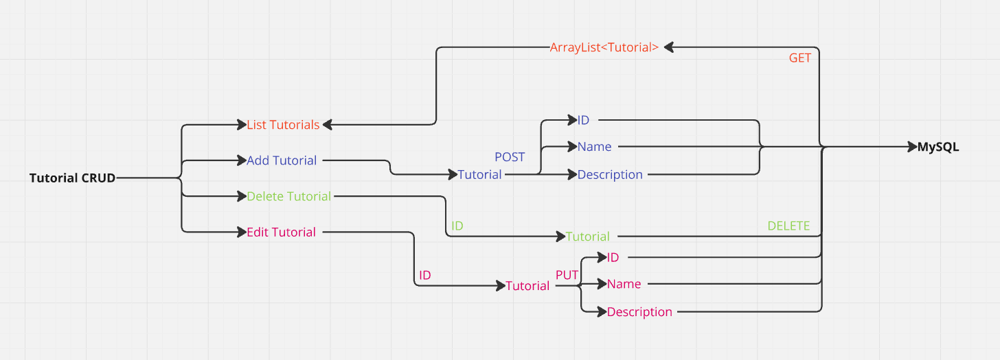

# TUTORIALS

 

## Development Description

The Backend component is developed that allows the user to manage tutorials implemented in Java. Users can upload and view tutorials, edit a tutorial, or delete it.

## Expected Features:

### CRUD

**Create:** Through a Frontend the user can upload and view tutorials, edit a tutorial or delete it (CRUD
- **Read:** Show all tutorials
- **Update:** Allows you to edit.
- **Delete:** Allows you to delete tutorials at your discretion.

### MVC
Implementation of inheritance, MVC, Dependency Injection, encapsulation to hide the internal implementation of classes and protect data.

 

## USER STORY

- **Title** Tutorial Management for Users
- **As** tutorial platform user
- **I want** to be able to manage tutorials easily and efficiently
- **To** be able to access educational resources in an organized and personalized way

#### Criteria of acceptance:

***See List of Tutorials***

- ***Given:*** I am a user,
- ***When:*** I navigate to the tutorials page,
- ***So:*** I can see a list of all available tutorials with their title AND description and author.

***Add Tutorials***

- ***Given:*** I am a user with creation permissions,
- ***When:*** I navigate to the add tutorials page,
- ***So:*** I can fill out a form with the title and description and content of the tutorial,
- ***Y:*** When you submit the form, the tutorial is added to the database and appears in the list of tutorials. .

***Delete Tutorials***

- ***Given:*** I am a user with delete permissions,
- ***When:*** I see a tutorial in the list,
- ***So:*** I can click a delete button next to the tutorial,
- ***Y:*** The tutorial is deleted from the database and no longer appears in the list.

***Update Tutorials***

- ***Given:*** I am a user with editing permissions,
- ***When:*** I see a tutorial in the list,
- ***So:*** I can click an edit button next to the tutorial,
- ***And I can modify:*** the title, description of the tutorial in a form,
- ***And when submitting the form:*** the changes are saved in the database and reflected in the list of tutorials.

 

## PROJECT DIAGRAM

 

### KANBAN
- https://trello.com/b/Plxv8nVo/tutorial-crud

 

### 👥 Collaborators

- https://github.com/miangels1978
- https://github.com/FJRJ3D
- https://github.com/israelcs13
- https://github.com/Jrdevangel